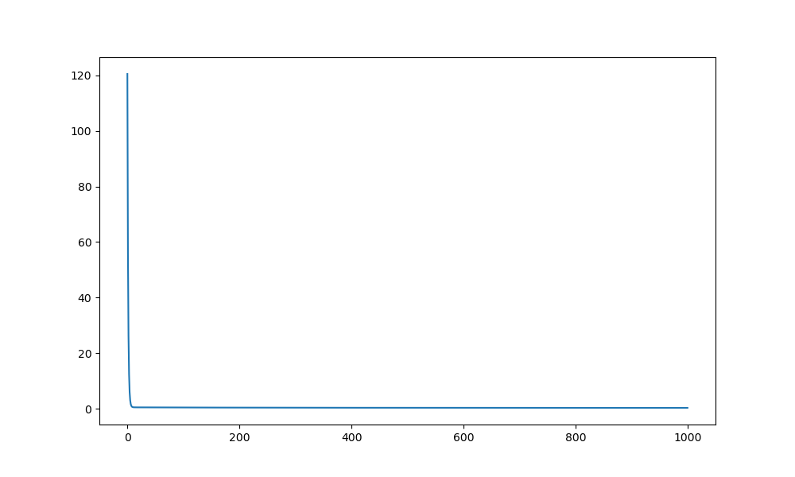
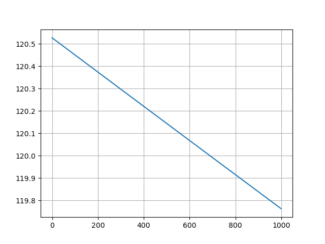
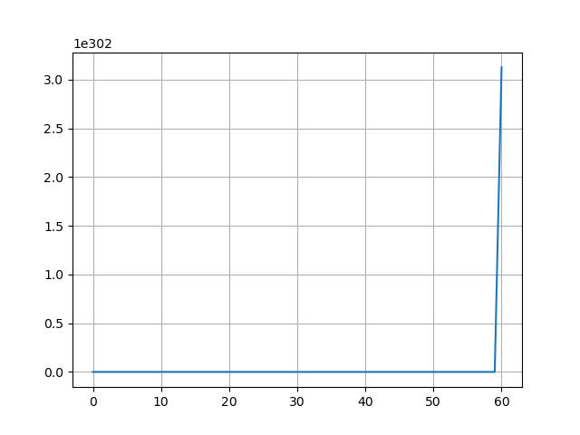

# Linear Regression with The Simple Equation
# And the Comparation with The Gredient Dencent

<div align="center">
  
  <br>
  <p>基于最小二乘法的线性回归实现</p>
</div>

[](https://www.python.org/)
[](https://opensource.org/licenses/MIT)
# 我的科技节作品

## 🎯 项目亮点
### 课本中的知识复现
高中数学必修2中提到的最小二乘法的代码实现。
### 创新性设计
- **自动生成训练集**：自动生成用于线性回归所需要的训练集
- **使用最小二乘法拟合线性回归**：利用最小二乘法直接求解出参数
- **算法创新**：项目中有不少的算法创新，我将一一展示
- **动态化展示**动态过程的梯度下降拟合，更直观凸显最小二乘法的高效

## 🔍 原理展示
### 数学推导可视化
#### 最小二乘法原理
对于数据点 $(x_i, y_i)$，我们寻找最佳拟合直线 $y = mx + b$，使得残差平方和最小：

$$
MINIMIZE \sum_{i=1}^{n}(y_i - (mx_i + b))^2
$$

#### 参数求解过程
    ```python
    #最小二乘法(simple equation)
    n = len(x)
    x_mean = np.mean(x)
    y_mean = np.mean(y)
    # 这里我直接使用矩阵乘法简化了求和过程
    # 最原始的使用for循环遍历，很低效，可读性也很差
    # 其次是使用numpy的sum函数，效率高了很多
    # 最后我想到用numpy的矩阵乘法，效率最高，可取性也最高！
    xi_times_yi = x @ y
    xi_squared = x @ x

    w_hat = (xi_times_yi - n * x_mean * y_mean)/(xi_squared - n * (x_mean)**2)
    b_hat = y_mean - w_hat * x_mean
   


## 🚀 创新性实现
### 与传统实现的对比
| 功能                | 传统实现          | 本项目的创新        |
|--------------------|-----------------|-------------------|
| 拟合方式            | 梯度下降          | 最小二乘法       |
| 可视化支持          | 无              | 实时拟合动画         |
| 计算复杂度          | O(n)            | O(1)       |

### 核心技术突破
1. **使用矩阵乘法算出参数**：
   ```python
   # 这里我直接使用矩阵乘法简化了求和过程
   # 最原始的使用for循环遍历，很低效，可读性也很差
   # 其次是使用numpy的sum函数，效率高了很多
   # 最后我想到用numpy的矩阵乘法，效率最高，可取性也最高！
   xi_times_yi = x @ y
   xi_squared = x @ x
2. **最小二乘法算出参数**
   ```python
   w_hat = (xi_times_yi - n * x_mean * y_mean)/(xi_squared - n * (x_mean)**2)
   b_hat = y_mean - w_hat * x_mean
3. **梯度下降中的优化策略**
   使用矩阵乘法算梯度,以及记录loss来调整学习率
   ```python
   dw = (1/m) * (y_pred - y) @ x

   -------------------------------------------
   loss = (1/(2*m)) * np.sum((y_pred - y) ** 2)
   loss_history.append(loss)
## 😀经验分享
### 梯度下降中的记录loss来调整学习率
#### $$正常的\alpha$$
<div align = 'center'>
  
  <p>$$正常的\alpha$$</p>
</div>
#### $$如果\alpha太小$$
<div align = "center">
  
  <p>$$\alpha太小$$</p>
</div>

#### $$如果\alpha太大$$
<div align = 'center'>
  
  <p>$$\alpha太大$$</p>
</div>

